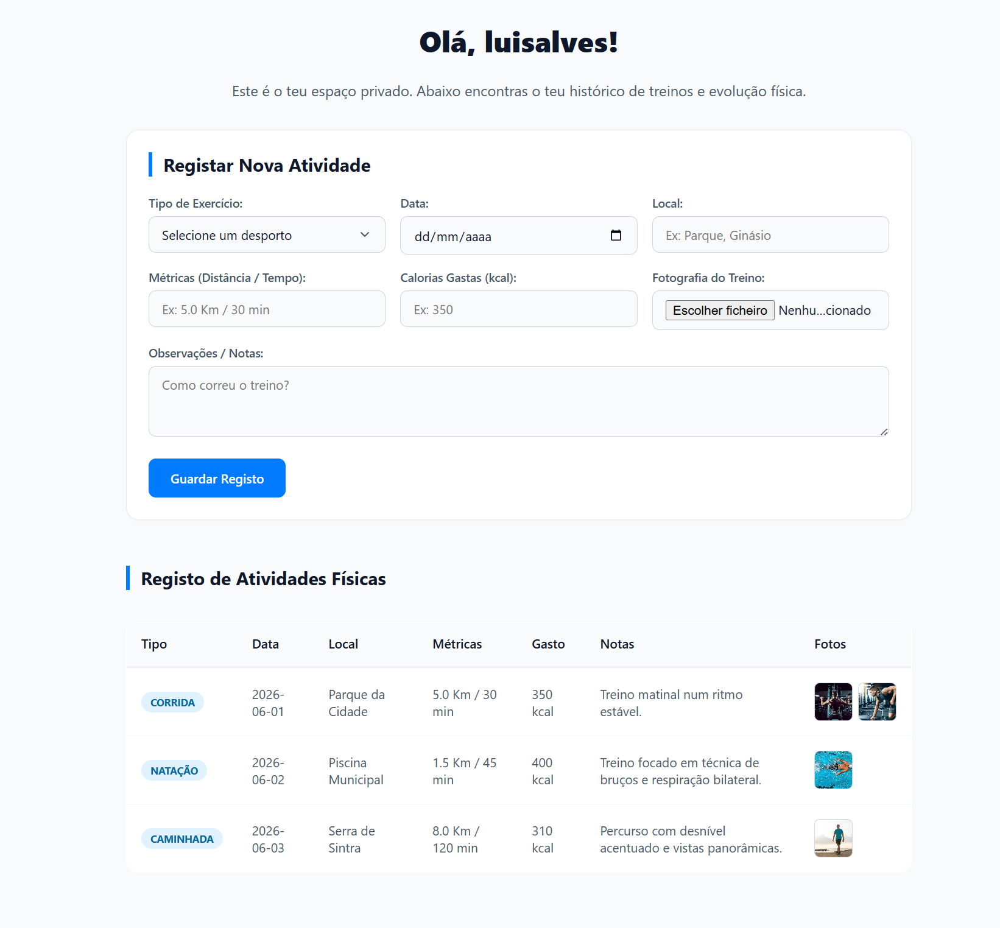
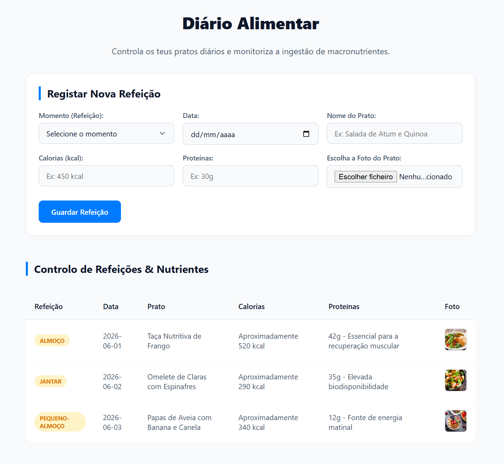

# ActiveFrame - Monitorização de Atividade Física e Alimentação

Repositório para alojar o projeto desenvolvido para 'Tecnologias da Internet', uma disciplina do primeiro ano na Universidade da Maia. Desenvolvido pelo Grupo inf25tig33: a050079, a048579, a050287.

## Breve descrição do tema

O ActiveFrame é um diário de saúde interativo que permite aos utilizadores gerir e monitorizar o seu histórico de treinos e refeições diárias. A plataforma cruza métricas quantitativas de saúde (como calorias e proteínas) com um registo visual cronológico, permitindo acompanhar a evolução física real através de fotografias. O sistema consome dados diretamente de um ficheiro XML validado por um XML Schema (XSD) e assegura a persistência local via `LocalStorage`.

## Organização do repositório

* O **código-fonte** está na [pasta src](src/).
* Os capítulos do relatório estão na [pasta doc](doc/).

## Galeria 1

| Registar Atividade Física | Diário Alimentar |
| :---: | :---: |
|  |  |

## Tecnologias

* [XML](https://developer.mozilla.org/en-US/docs/Web/XML/XML_introduction)
* [JSON](https://developer.mozilla.org/en-US/docs/Learn/JavaScript/Objects/JSON)
* [HTML5 + CSS3](https://developer.mozilla.org/en-US/docs/Web/Guide/HTML/HTML5)
* [Javascript (ES6)](https://developer.mozilla.org/en-US/docs/Web/JavaScript)

### Frameworks e Bibliotecas

De forma a cumprir os critérios de avaliação, o projeto foi desenvolvido em **Vanilla Web Technologies** (sem bibliotecas externas). Foram utilizadas as seguintes APIs nativas:
* LocalStorage API (Persistência de dados locais)
* DOMParser API (Manipulação e leitura da árvore XML)

## Relatório

### Apresentação do projeto
* Capítulo 1: [Apresentação do projeto](doc/c1.md)

### Interface com o Utilizador
* Capítulo 2: [Protótipo de Interface e Sitemap](doc/c2.md)

### Produto
* Capítulo 3: [Produto](doc/c3.md)

### Apresentação
* Capítulo 4: [Apresentação](doc/c4.md)

## Equipa
* João Diogo Moita Pinto — [@JPintoUmaia](https://github.com/JPintoUmaia)
* Luis Fernando Oliveira Alves — [@a048579](https://github.com/@a048579)
* Miguel Fernandes — [@Colega2](https://github.com/Colega2)
