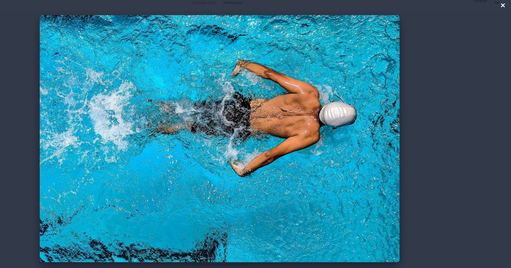
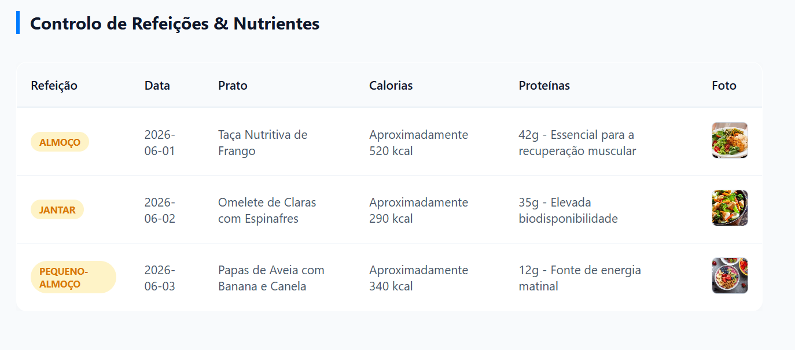

# Capítulo 1: Apresentação do Projeto

### 1.1. Razão da Escolha e Enquadramento
A escolha deste tema nasce da junção dos nossos interesses pessoais com os objetivos da disciplina. Sendo o nosso grupo praticante de exercício físico e tendo a vontade de melhorar e monitorizar os nossos hábitos alimentares, percebemos que o registo visual (fotográfico) é uma das melhores formas de manter a motivação.

Do ponto de vista académico na Universidade da Maia, o ActiveFrame permite explorar o conceito de Multimédia, utilizando a fotografia como elemento central de um diário, enquanto nos desafia a estruturar e relacionar diferentes tipos de dados (utilizadores, treinos, refeições e álbuns de imagens) através de XML e a manipulá-los dinamicamente com JavaScript.

 

### 1.2. Funcionalidades Propostas
* **Sistema de Autenticação (Simulado)**
* **Diário de Atividades Físicas**
* **Diário de Alimentação**
* **Filtros de Pesquisa**
* **Dashboard Resumo**

 

### 1.2.1. Funcionalidades Desenvolvidas
O projeto é composto pelas seguintes funcionalidades principais:

* **Sistema de Autenticação (Simulado):** Ecrã de Login e opção de Logout. É validado através de dados lidos do XML e gerido via `localStorage` no JavaScript.
* **Diário de Atividades Físicas:** Uma tabela/grelha interativa onde listamos os treinos com os campos: Local, Data, Tipo de Exercício, Distância (Km) / Tempo, Observações e Calorias.
* **Álbum Multimédia:** Cada linha da tabela contém um gatilho que abre um álbum de fotos (Galeria/Carrossel) específico dessa atividade.
* **Diário de Alimentação:** Uma secção dedicada ao registo das refeições diárias (Pequeno-almoço, Almoço, Jantar, Lanches), incluindo a descrição do aporte de calorias e proteínas, além de uma fotografia do prato.

#### Demonstração Visual das Funcionalidades

| Sistema de Autenticação | Diário de Atividades Físicas |
| :---: | :---: |
|  |  |
| **Álbum Multimédia** | **Diário de Alimentação** |
|  |  |

*Figura 1.1: Matriz de funcionalidades principais implementadas na plataforma ActiveFrame.*

 

### 1.2.2. Funcionalidades propostas não desenvolvidas
Durante a fase de implementação, optou-se por não incluir as seguintes funcionalidades inicialmente previstas na proposta:
* **Filtros de Pesquisa:** Possibilidade de filtrar as tabelas usando JavaScript (ex: mostrar apenas as atividades do tipo "Corrida" ou filtrar as refeições de uma data específica).
* **Dashboard Resumo:** Uma área visual no topo da página, atualizada por JavaScript, que soma os quilómetros percorridos ou os treinos realizados com base nos dados do ficheiro XML.

 

### 1.3 Tecnologias Utilizadas
- **HTML5**: Utilizado para criar a estrutura semântica das páginas, incluindo tabelas, formulários e botões.
- **CSS3**: Responsável pelo design da aplicação, garantindo uma interface moderna, apelativa e responsiva, adaptável tanto a computadores como a dispositivos móveis.
- **XML**: Funcionará como a base de dados em formato de texto, armazenando os registos dos utilizadores, atividades, refeições e os caminhos (links) para as fotografias.
- **XSD**: Utilizado para validar rigorosamente a estrutura do ficheiro XML, garantindo, por exemplo, que uma atividade não seja registada sem uma data ou que os links das fotografias estejam no formato correto.
- **JavaScript**: Será o "cérebro" do projeto, responsável por ler o ficheiro XML, gerar tabelas dinamicamente no ecrã, criar galerias de fotografias interativas e gerir as sessões de autenticação (login).
- **GitHub**: Utilizado para o controlo de versões, permitindo que o grupo trabalhe de forma sincronizada e segura sobre o mesmo código, servindo também como portefólio do projeto final.
