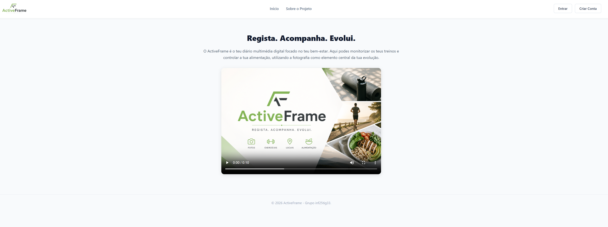
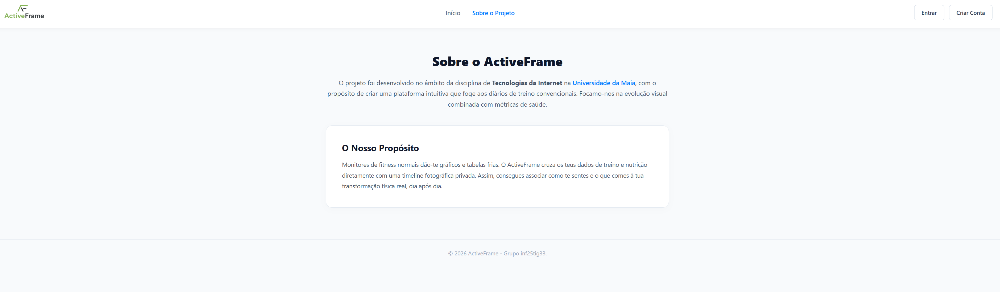
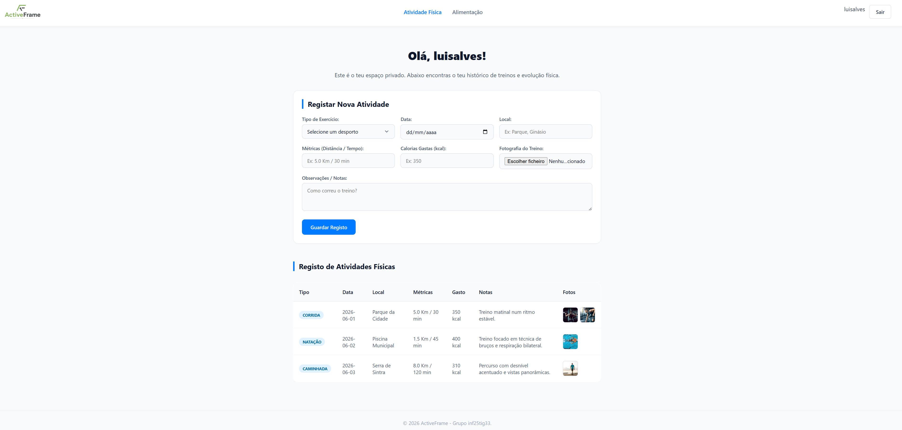
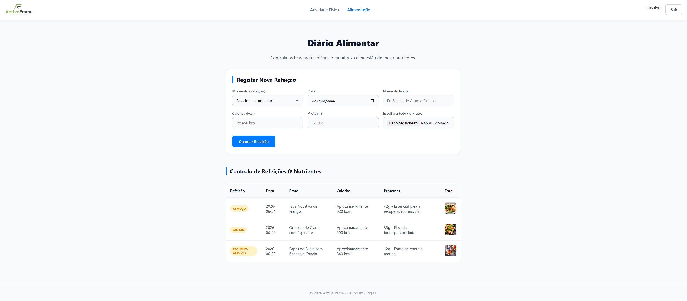

# Capítulo 2: User Interface

### 2.1. Filosofia de Design e Layout
A interface do ActiveFrame foi desenhada seguindo princípios modernos de UI/UX: Minimalismo e Coerência. Utilizou-se uma palete de cores sóbria, com forte domínio do branco e cinzentos claros para as superfícies de dados, contrastando com o azul institucional (`#007bff`) para guiar o foco do utilizador nas ações principais da página.

O posicionamento dos elementos estruturais baseia-se em CSS Grid e Flexbox, garantindo que as caixas de inserção e os formulários alinhem de forma fluida, garantindo que o design seja totalmente adaptável a ecrãs de computador ou telemóvel.

### 2.2. Fluxo de Navegação e Páginas (Sitemap)
O ecossistema da aplicação divide-se em duas grandes áreas de acesso:

* **Zona Pública:**
  * `index.html` — Portal de boas-vindas com o formulário de Autenticação integrado (Login e Registo).
  * `sobre.html` — Página institucional com a descrição do projeto e os créditos académicos do grupo.
* **Zona Privada (Protegida por validação de Sessão):**
  * `atividade_fisica.html` — Painel de controlo de treinos com formulário de inserção e histórico.
  * `alimentacao.html` — Diário alimentar focado no controlo de refeições e macronutrientes.
 
#### Interfaces do Ecossistema ActiveFrame

| index.html (Autenticação) | sobre.html (Sobre o Projeto) |
| :---: | :---: |
|  |  |
| **atividade_fisica.html (Treinos)** | **alimentacao.html (Alimentação)** |
|  |  |

*Figura 2.1: Demonstração visual das páginas que constituem a árvore do site.*

### 2.3. Componentes de Inserção Dinâmicos
Para melhorar a usabilidade da aplicação e evitar erros de digitação por parte do utilizador, os campos de "Tipo de Exercício" e "Momento (Refeição)" foram transformados em elementos `<select>` dinâmicos. 

