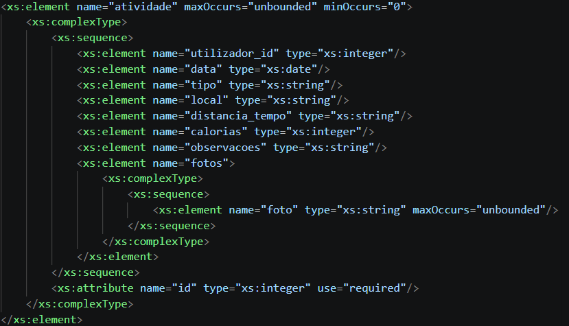
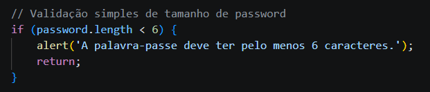
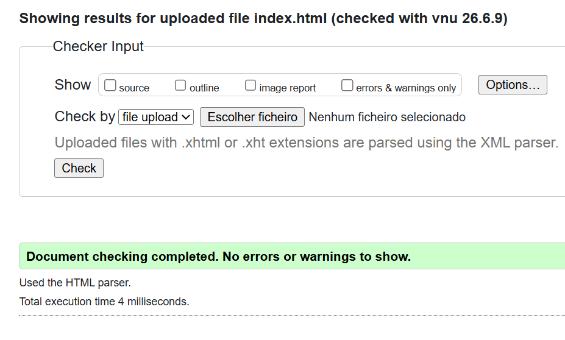
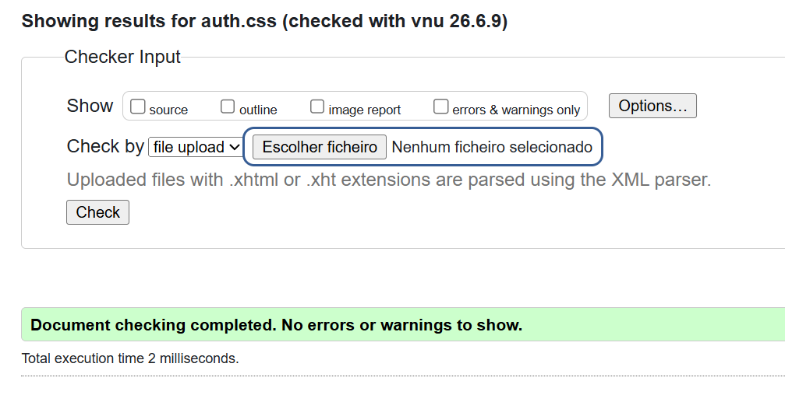
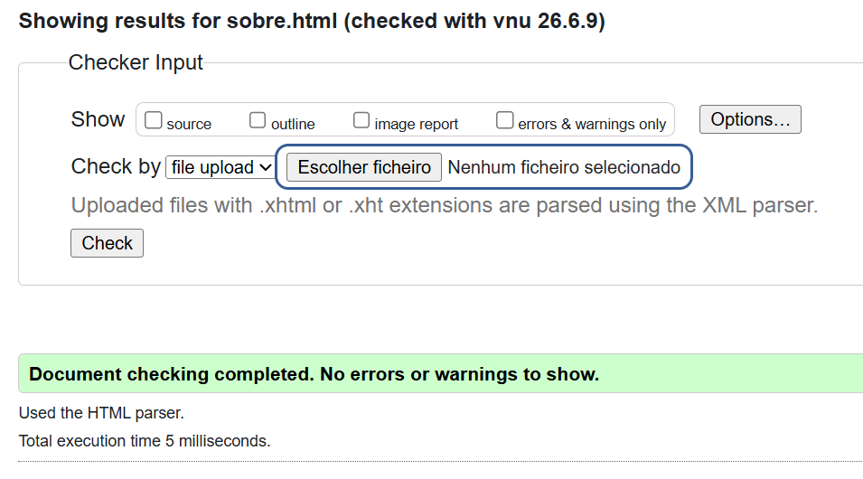
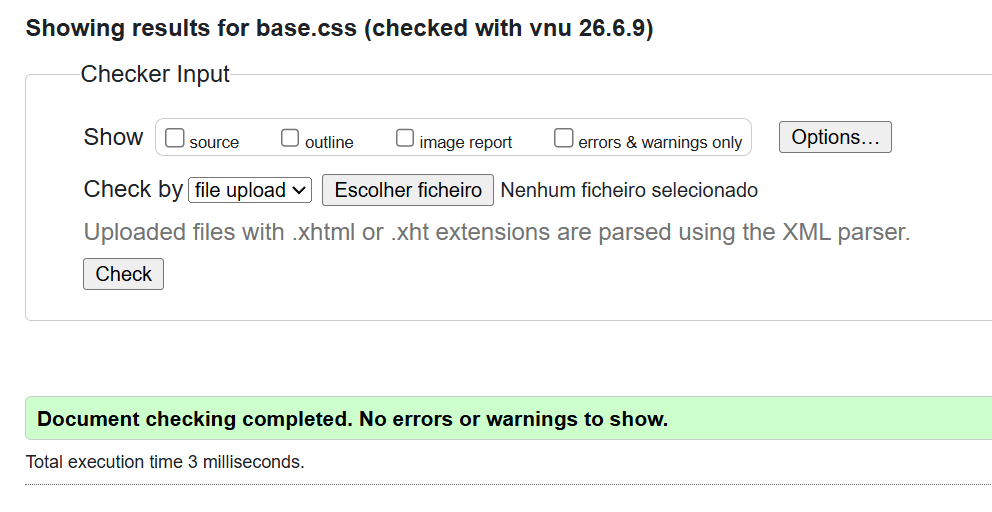
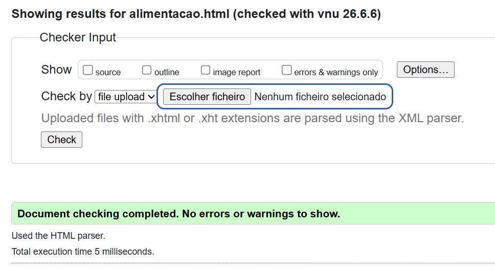
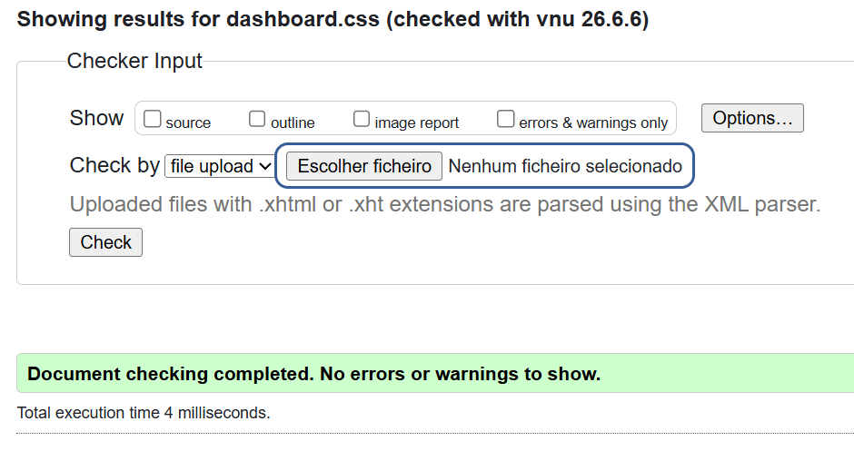
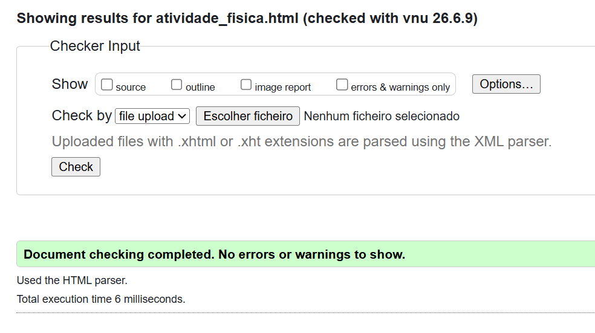

# Capítulo 3: Produto

### 3.1. Descrição do Produto
O **ActiveFrame** é uma plataforma de gestão de saúde pessoal que combina o registo quantitativo de dados com a componente visual. O sistema permite aos utilizadores monitorizar treinos e hábitos alimentares, cruzando métricas como calorias e macronutrientes com uma galeria cronológica da sua evolução física. 
A arquitetura do projeto baseia-se na estruturação de dados através de **XML (validado por XSD)** e na persistência local via **LocalStorage**, proporcionando uma solução leve, eficiente e focada na experiência do utilizador.

 

### 3.2. Publicação e Deploy (Netlify)
O processo de deploy da aplicação foi automatizado através da integração direta entre o repositório **GitHub** e a plataforma **Netlify**.

* **Configuração de Build:** Definimos a pasta `/src` como o Publish directory, garantindo que apenas os ficheiros necessários para a execução da aplicação (código-fonte, recursos e assets) sejam expostos no ambiente de produção.
* **Identificação do Projeto:** O projeto foi configurado com o identificador de grupo `inf25tig33`. A aplicação encontra-se acessível através do subdomínio atribuído: [inf25tig33.netlify.app](https://inf25tig33.netlify.app).

 

### 3.3. Regras de Utilização
O acesso à plataforma é gerido através de um sistema de autenticação local:

* **Registo de Conta:** O utilizador pode efetuar o registo através do botão "Criar conta", localizado no canto superior direito da interface.
* **Persistência de Dados:** As credenciais e dados do utilizador são armazenados no *LocalStorage* do navegador.
    * **Nota:** A persistência dos dados está dependente da memória cache do browser. Caso o utilizador limpe os dados de navegação (cache/cookies), o registo será eliminado, sendo necessário realizar um novo registo.

*Figura 3.3: Interface de registo da aplicação ActiveFrame.*

#### 3.3.1. Estruturação da Base de Dados XML (`dados.xml`)
O armazenamento central do ActiveFrame assenta no ficheiro `dados.xml`, que funciona como a nossa "base de dados" em formato de texto. Este documento guarda de forma estruturada os registos dos utilizadores (com credenciais), atividades (com detalhes e links para os ficheiros de imagem na pasta do projeto) e as refeições diárias.

#### 3.3.2. Validação Semântica via XML Schema (`schema.xsd`)
Para garantir a robustez e integridade dos dados, o ficheiro `schema.xsd` é utilizado para validar rigorosamente a árvore de nós do ficheiro XML. Este validador garante, por exemplo, que uma atividade não é registada sem uma data válida (tipo `xs:date`), que os campos numéricos (como calorias e IDs) respeitam a tipagem `xs:integer`, e que os atributos obrigatórios estão presentes.

#### 3.3.3. Lógica e Persistência Híbrida (JSON e LocalStorage)
Através do JavaScript, o ficheiro XML é lido de forma assíncrona logo que o utilizador faz login. O script extrai a informação através do interpretador DOM e injeta-a no HTML sob o formato de tabelas e galerias fotográficas. 
Para permitir novos registos sem a necessidade de um servidor de escrita ativo, os dados submetidos nos formulários são capturados pelo JavaScript, convertidos em objetos JSON (`JSON.stringify`) e guardados no `localStorage` do navegador, fundindo-se dinamicamente com os dados estáticos lidos do XML.

 

### 3.4. Ajuda de Navegação
Para facilitar a interação e a experiência do utilizador (UX), implementámos mecanismos de orientação em todos os formulários:
* **Preenchimento Orientado:** Os campos dos formulários incluem valores predefinidos (*placeholders* ou exemplos), permitindo que o utilizador compreenda intuitivamente o tipo de informação esperada (ex: formato de data, unidades de medida, etc.).

*Figura 3.4: Exemplo de auxílio ao preenchimento no formulário de atividades.*

 

### 3.5. Validações de formulários
A integridade da informação é garantida por uma estratégia de validação híbrida, combinando restrições estruturais e validação lógica em tempo real:

* **Validação via XSD:** Utilizamos *XML Schema* (XSD) para definir restrições estruturais rigorosas, impedindo a entrada de valores inválidos ou fora dos limites definidos no esquema.
* **Validação via JavaScript:** Para interações dinâmicas, utilizamos JavaScript para validar regras de negócio que requerem feedback imediato. Um exemplo crítico é o formulário de autenticação, onde a palavra-passe é validada com um requisito mínimo de 6 caracteres.

*Figura 3.5: Exemplos de implementação das validações: restrição via XSD (esquerda) e lógica de validação via JavaScript (direita).*

 

### 3.6. Validação do HTML e CSS
Foi usado o validador w3c "https://validator.w3.org/" para a validação dos nossos documentos CSS e HTML
## Galeria de validações

| Validação HTML | Validação CSS |
| :---: | :---: |
|  |  |
|  |  |
|  |  |
|  

 
 
